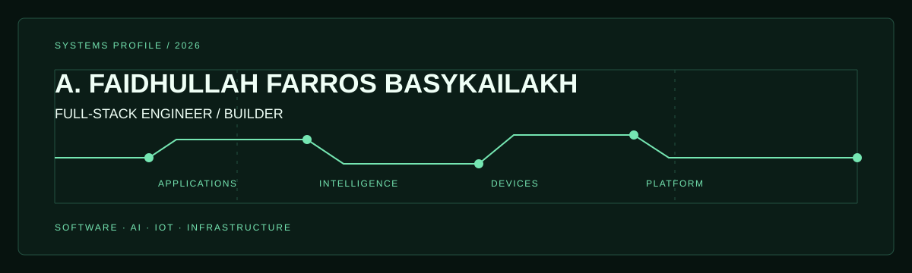

<div align="center">



<br />

[Sangkolo](https://sangkolo.com) &nbsp;·&nbsp; [Email](mailto:farrosy6@gmail.com) &nbsp;·&nbsp; [GitHub](https://github.com/bayezsyka)

</div>

```text
SYSTEM PROFILE
Building production-minded digital systems where applications, models, devices,
and infrastructure meet real operational work.
```

## Operating Areas

<table>
  <tr>
    <td width="25%" valign="top">
      <strong>Software</strong><br /><br />
      Full-stack applications, business systems, dashboards, APIs, CMS, LMS, and workflow automation.
    </td>
    <td width="25%" valign="top">
      <strong>AI &amp; Research</strong><br /><br />
      Computer vision, object detection, classification, and predictive systems.
    </td>
    <td width="25%" valign="top">
      <strong>IoT</strong><br /><br />
      Embedded monitoring, sensor networks, automation, and real-time communication.
    </td>
    <td width="25%" valign="top">
      <strong>Infrastructure</strong><br /><br />
      Self-hosted services, containers, virtualization, networking, and deployment workflows.
    </td>
  </tr>
</table>

## Technical Field Notes

| Domain | Toolkit |
| :--- | :--- |
| `application` | Laravel · PHP · React · Next.js · Inertia.js · JavaScript · Tailwind CSS · MySQL |
| `intelligence` | Python · OpenCV · YOLO · LSTM · XGBoost |
| `connected systems` | ESP32 · ESP8266 · MQTT |
| `platform` | Linux · Proxmox · LXC · Docker · Cloudflare |

## Project Index

| Repository | Work |
| :--- | :--- |
| [`sangkolo`](https://github.com/bayezsyka/sangkolo) | Technology products and operational systems developed through Sangkolo Mitra Teknologi. |
| [`maggot-paper`](https://github.com/bayezsyka/maggot-paper) | Computer vision and applied machine learning research. |
| [`alanwarpakijangan`](https://github.com/bayezsyka/alanwarpakijangan) | Web-based institutional system. |
| [`shoewash-api`](https://github.com/bayezsyka/shoewash-api) | Backend API for operational workflows. |

<details>
<summary><strong>About the builder</strong></summary>
<br />

I am pursuing a double-degree path in <strong>Computer Engineering</strong> and <strong>Law</strong>. My work spans the full delivery path, from the application interface and machine-learning model to embedded devices, server infrastructure, and production deployment.

</details>

<div align="center">

<br />

<sub>Useful systems. Clear constraints. Reliable delivery.</sub>

</div>
